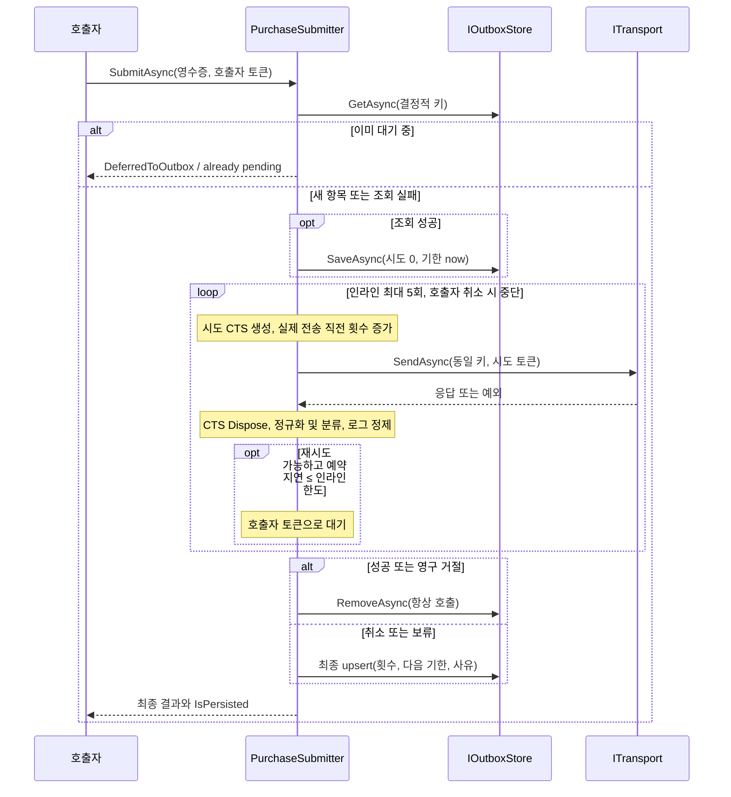

# 설계 메모

이 문서는 PurchaseSubmitter의 전송 흐름과 결과 계약을 설명합니다. 결정적 거래 키와 서버의 멱등 처리가 중복 결제를 막고, 전송 전 outbox 저장이 응답 유실과 재시작에 대비합니다. 키는 거래 ID의 UTF-8 SHA-256에 `pur_` 접두사를 붙입니다. 저장소와 네트워크는 주입되는 경계입니다.

성공/영구 거절이 최우선이고, 다음은 호출자 취소, 그 외는 저장 여부에 따른 보류/저장 실패입니다. 이번 호출에서 한 번이라도 저장에 성공했고 이후 제거 성공이 없으면 `IsPersisted`는 true입니다. 제거 실패만으로 true가 되지 않습니다. 기존 대기 항목 반환은 true입니다. 저장소 오류는 SubmitAsync 안에서 Warning으로 기록하며 전송 오류로 분류하지 않습니다. 조회 실패 시 초기 저장을 생략하고 전송하므로 누적 카운터가 초기화될 수 있습니다. 갱신 실패 시 저장된 카운터가 오래된 값이어도 보관 사실은 유지합니다.

예약 지연은 429/503의 유효한 Retry-After가 우선이며 정확한 값을 쓰고 지터·MaxDelay 상한을 적용하지 않습니다. 다만 현재 시각에 더한 예약 시각이 DateTimeOffset 범위를 넘으면 헤더를 무효로 보고 백오프로 대체합니다. 파서의 TimeSpan 반환 계약은 유지합니다. 그 외에는 누적 시도 횟수의 백오프를 씁니다. 백오프만 지터 전 상한이 있습니다. 인라인 한도(기본 30초)를 초과하거나 마지막 시도이면 대기 없이 예약합니다. StopKeep/Unexpected도 백오프로 예약합니다. 실제 시작된 전송만 누적하며 전송 전/중 호출자 취소는 다음 기한을 now로 둡니다. **D3: 인라인 대기 중 취소는 이미 정한 Retry-After 또는 백오프의 NextAttemptAt을 보존합니다.** 따라서 곧바로 새 토큰으로 flush해도 예약 기한 전에는 전송하지 않습니다.

Flush는 CreatedAt 순서로 처리하고 기한 미도래, 누적 20회 도달 항목을 건너뜁니다. 정지 항목은 Warning과 함께 보관합니다. 대상마다 원래 키로 한 번 전송하고 인라인 대기 없이 갱신하거나 제거합니다. 호출자 취소는 부분 결과를 반환하고 진행 중 항목을 보관합니다. SendAsync 직전 취소를 관찰해 전송을 시작하지 않은 항목은 Succeeded/Rejected/Remaining에 포함하지 않고 다시 저장하지 않습니다. Load 오류는 전파하지만 항목별 저장 오류는 Warning/StoreErrors로 기록하고 다음 항목을 계속 처리합니다. StoreErrors는 전송 결과 집계와 독립적입니다.

대기나 시계 의존성의 예외도 최종 처리로 이어집니다. 확정된 성공/영구 거절은 제거 후 해당 결과를 유지하고, 그 외에는 예외 타입 이름을 LastReason으로 최종 upsert한 뒤 D1에 따라 반환합니다. 시계 실패 시 마지막으로 확보한 시각을 사용하며, 첫 시계 조회부터 실패하는 경우를 위해 조회 전에 시스템 UTC 시각을 확보합니다. 호출자 취소는 별도 경로로 처리합니다. 로그 실패는 WriteLog 경계에서 격리해 저장·제거·결과 반환·다음 flush 항목 처리를 막지 않습니다.

시도마다 생성한 연결 CTS는 submitter 소유이며 종료 시 Dispose합니다. 호출자 토큰과 시도 토큰을 구분해 사용자 취소를 재시도하지 않습니다. 테스트는 실제 시간 경과 대신 수동 CTS 취소를 사용합니다. 영수증·서명·토큰·이메일은 로그에서 가리고, 시도별 번호·종류·키 및 최종 결과를 기록합니다. Unity 어댑터의 요청 자원 정리는 추후 구현 범위입니다.

LogRedactor는 유효한 JSON 객체/배열을 System.Text.Json으로 읽고, 깊이에 상관없이 디코딩된 속성명을 대소문자 구분 없이 비교해 민감 값을 가린 뒤 직렬화합니다. JSON의 문자열 값 안에 있는 form/query도 그 문자열 안에서만 마스킹합니다. 그 외 입력에는 form/query 정규식을 적용하며 값은 `&`, 공백, 따옴표, `,;}`에서 끝납니다. 반복 마스킹 결과는 같습니다.

리뷰 회귀 테스트는 ReviewRegressionTests.cs의 여섯 메서드(18개 실행 케이스)로 위 경계를 검증합니다. 로거 예외, 대기/시계 예외와 최종 저장 결과, 대기 취소 후 예약 유지, 날짜 범위를 넘는 Retry-After, 중첩 JSON 및 form 경계, 전송 직전 취소의 부분 집계를 각각 검사하며 세부 매핑은 [spec-test-map.md](spec-test-map.md)에 있습니다.
